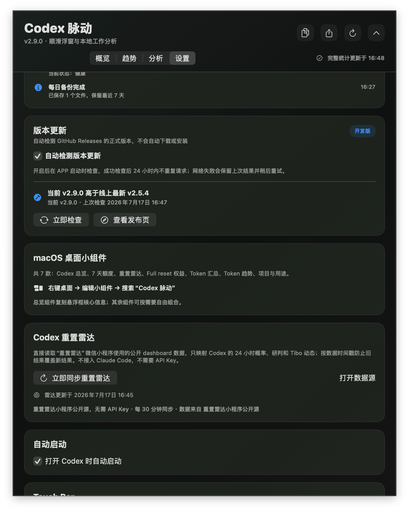
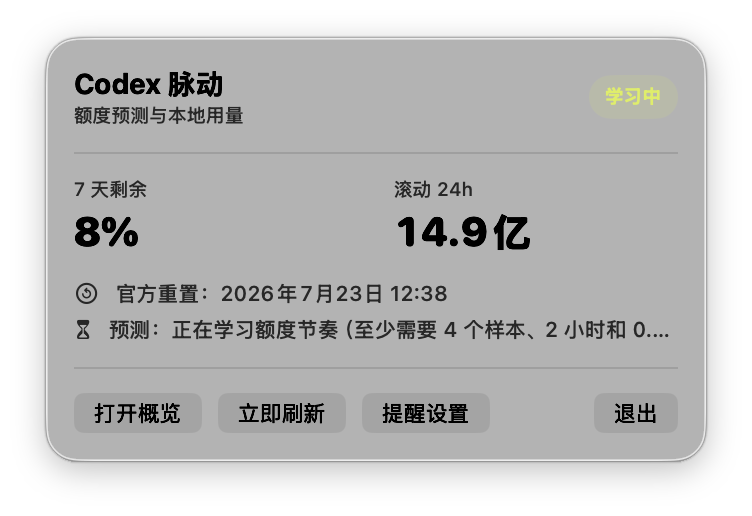
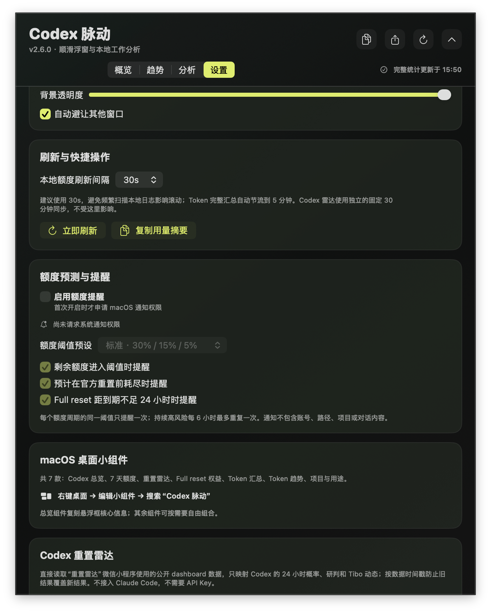
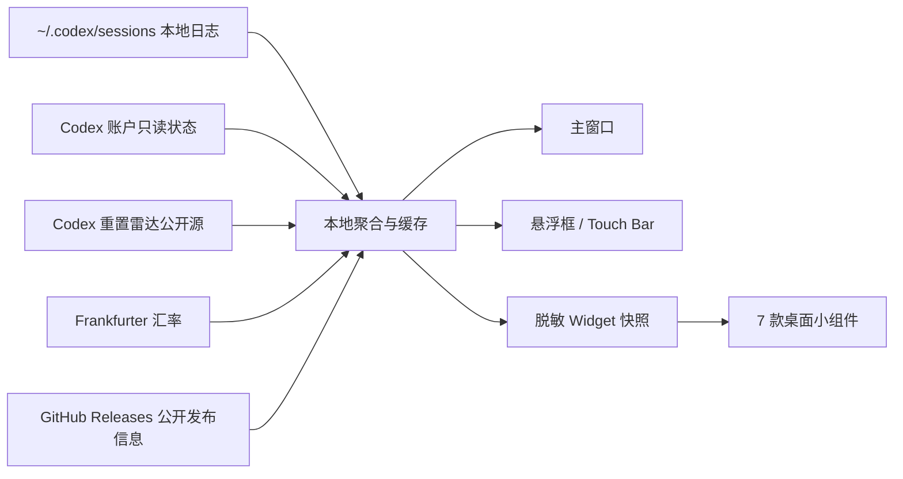

<p align="center">
  
</p>

<h1 align="center">Codex 脉动</h1>

<p align="center">
  原生 macOS Codex 状态面板、悬浮框与桌面小组件
</p>

<p align="center">
  
  
  
  
  <a href="LICENSE"></a>
</p>

`Codex 脉动` 将 Codex 的额度、Token 消耗、重置节奏和 Full reset 权益集中到一套原生 macOS 界面中。它既可以作为常驻悬浮框，也可以完全隐藏悬浮框，仅使用主窗口或 7 款桌面小组件。

> 当前版本：`2.10.0` build 2102。分别提供 Apple Silicon（arm64）与 Intel（x86_64）安装包；两者均为 ad-hoc 签名、未公证版本，要求 macOS 14 或更高版本。

## 当前版本界面

`Codex 脉动 2.10.0` 在趋势页加入“24 小时 / 按天”切换；两种视图都可将 iCloud 中的多台设备按时间对齐后分色堆叠，按天视图可横向滚动查看最近 30 个自然日。以下截图展示继续保留的自动版本更新检测。

<p align="center">
  
  <br>
  <sub>设置页：自动检测、24 小时节流、手动检查与发布页入口</sub>
</p>

<table>
  <tr>
    <td align="center" valign="top" width="38%">
      
      <br><sub>菜单栏：额度、风险、预计耗尽、Token 与快捷操作</sub>
    </td>
    <td align="center" valign="top" width="62%">
      
      <br><sub>提醒：主动授权、三套阈值、预测高风险与 Full reset 到期提醒</sub>
    </td>
  </tr>
</table>

## 功能一览

| 能力 | 展示内容 |
| --- | --- |
| 官方额度 | Codex 7 天剩余额度、已用比例和重置倒计时 |
| 额度预测 | 本地记录官方额度百分点，估算消耗速度、耗尽区间、均衡日上限和风险等级 |
| 原生提醒 | 用户主动开启后，按额度阈值、预测高风险和 Full reset 到期发送 macOS 通知 |
| Token 统计 | 滚动 24 小时、最近 30 天按日趋势、多设备分色堆叠、今日、近 7 天、本月 Token，以及 input、cached input、output 和 model |
| 重置雷达 | Codex 24h 重置概率、研判、公开摘要、更新时间和 Tibo PT 时钟 |
| Full reset | 可用次数、获得时间和逐次到期日，只读展示，不提供消耗操作 |
| 高级分析 | 最近 14 天、同期对比、月末推演、异常高峰、缓存/模型/项目集中度及智能诊断 |
| 项目预算 | 为已识别项目设置月度 Token 上限，追踪已用、剩余、月末预计和风险 |
| 可靠性 | 7 项健康检查、状态事件、受控自动恢复和脱敏诊断报告 |
| 自动化 | 定时巡检、每日关键数据备份、可选每日聚合摘要和 7 天备份保留 |
| 版本更新 | 启动自动检查 GitHub Releases，语义化版本比较、24 小时节流和手动查看下载入口 |
| 金额估算 | 按 OpenAI 官方模型价格估算 API 等价金额，并通过 Frankfurter 换算 USD/CNY |
| 显示载体 | 主窗口、菜单栏状态面板、可配置悬浮框、Touch Bar、7 款 WidgetKit 桌面小组件 |
| 外观 | 极光、玻璃、石墨三套视觉方案，六套主题色，以及跟随系统、白天、夜晚背景模式 |

金额是 API 等价预估，不是 ChatGPT/Codex 订阅账单。reasoning token 已包含在 output 中，不重复计费。

## 四种使用形态

### 1. 完整主面板

主窗口分为“概览、趋势、分析、设置”四个区域：

- 概览：额度、Token 汇总、重置雷达、Full reset 权益和最近额度事件。
- 趋势：24 小时逐时视图、可横向滚动的最近 30 天按日视图、多设备分色堆叠与悬停明细，以及模型构成。
- 分析：同期对比、月末推演、稳健异常检测、缓存/模型/项目集中度、项目预算和最近调用。
- 设置：刷新频率、额度提醒、可靠性/自动化、版本更新、悬浮框、主题、Touch Bar 和桌面小组件。

### 2. 菜单栏状态面板

- 菜单栏直接显示 7 天剩余百分比。
- 点开后查看官方重置时间、风险状态、预计耗尽和滚动 24h Token。
- 可快速打开概览、刷新、进入提醒设置或退出 App。
- 检测到新版本时，菜单栏显示版本号和“查看更新”入口。
- 关闭主窗口后 App 仍留在菜单栏刷新；`Command-Q` 或“退出”才结束进程。

### 3. 可选择的悬浮框

悬浮框不是必选项。在“设置 → 悬浮框”中可以：

- 开启或关闭悬浮框总开关；关闭后，小组件和普通主窗口仍可继续使用。
- 分别选择是否显示 7 天额度、滚动 24h Token、重置雷达和 Full reset 权益。
- 在“额度环、圆形、方形、胶囊、横条、横条·详细、徽章、徽章·详细”八种样式间切换。
- 选择额度环横向或竖向排列；样式会随所选信息自动调整尺寸。

由 Codex 自动唤起时，如果悬浮框已关闭，App 会静默在后台更新数据；手动打开 App 时仍会显示普通主窗口。

### 4. 七款桌面小组件

| 小组件 | 尺寸 | 主要信息 |
| --- | --- | --- |
| Codex 算力总览 | 中、大 | 7 天额度、滚动 24h、重置概率、Full reset；大号增加 Token 汇总、费用和趋势 |
| 7 天额度 | 小、中 | 剩余额度环、已用比例和重置倒计时 |
| Codex 重置雷达 | 小、中 | 24h 重置概率、研判、公开摘要和更新时间 |
| Full reset 权益 | 小、中 | 可用次数和最多 3 次到期时间 |
| Token 汇总 | 小、中 | 滚动 24h、今日、近 7 天、本月 Token 和金额预估 |
| Token 趋势 | 中、大 | 24 小时逐时柱状图；大号增加最近 14 天趋势 |
| 项目与用途 | 中、大 | 今日项目 Top 3 和本月用途 Top 3 |

安装并打开一次 App 后，在桌面空白处右键，选择“编辑小组件”，搜索“Codex 脉动”即可添加。更多说明见 [桌面小组件指南](docs/WIDGETS.md)。

## 白天与夜晚背景

App 提供三种背景模式：

- 跟随系统：随 macOS 外观自动切换。
- 白天：手动固定为浅色背景。
- 夜晚：手动固定为深色背景。

主窗口、设置页和八种悬浮样式共享这一设置；桌面小组件随系统外观自动适配。

## 数据来源与工作方式



- 本地用量从 `~/.codex/sessions` 增量读取，聚合 input、cached input、output、model、项目和工作类型。
- 额度预测只记录官方 7 天窗口的剩余百分点、采样时间和官方重置时间，最多保留 30 天。
- 项目预算保存于 `~/Library/Application Support/CodexSuanliMeter/project-budgets-v1.json`，高级分析只使用已有本机聚合结果。
- 可靠性事件位于 `reliability-events-v1.json`；备份和每日摘要位于 `~/Library/Application Support/CodexSuanliMeter/automation/`。
- Codex 额度和 Full reset 权益通过只读方式获取；Full reset 不提供兑换或消耗入口。
- 重置雷达读取小程序实际使用的公开 `/radar-api/dashboard` 数据，无需 API Key，每 30 分钟自动同步。
- USD/CNY 汇率来自 Frankfurter；网络失败时使用上次成功缓存。
- 版本更新只读取项目公开 GitHub Release 标签、时间、说明和下载链接。
- iCloud 仅同步小时、日、月聚合 Token 与模型名，使用 schema 4 的 `设备-codex-v2.json`。

## 隐私边界

- Codex 会话日志只在本机只读解析，不上传原始消息。
- Full reset 凭据和原始响应只在内存中短暂使用；缓存不保存 token、完整账户 ID、后台权益 ID 或原始响应。
- Widget 快照只包含额度、公开雷达、权益到期时间和聚合 Token，不包含会话内容、项目路径、账户凭据、API Key 或兑换 ID。
- 重置雷达公开数据采用 30 分钟内存缓存，不写入 iCloud。
- 会话解析缓存位于独立 Application Support 目录，只保存增量聚合所需结果。
- 额度历史位于 `~/Library/Application Support/CodexSuanliMeter/quota-history-v1.json`，不包含对话、项目路径或账户凭据。
- 项目预算只保存项目识别名/本地路径和用户设定的 Token 上限，不上传、不写入 iCloud 或 Widget 快照。
- 自动化备份仅复制额度历史和项目预算；每日摘要不包含对话正文或项目路径。
- 脱敏诊断报告不包含账号、对话、项目路径、凭据或 API Key。
- 原生提醒默认关闭；只有用户主动开启后才申请 macOS 通知权限。
- 版本检测不读取 GitHub Token 或账号，不上传本地数据，也不会自动下载或安装。

## 安装

在 [Releases](https://github.com/huohuo143/codex-pulse/releases) 下载：

```text
Codex-Pulse-v2.10.0-build2102-20260727-arm64.dmg
Codex-Pulse-v2.10.0-build2102-20260727-arm64.dmg.sha256
Codex-Pulse-v2.10.0-build2102-20260727-x86_64.dmg
Codex-Pulse-v2.10.0-build2102-20260727-x86_64.dmg.sha256
```

1. 打开 DMG。
2. 将 `Codex 脉动.app` 拖入 Applications；也可以运行 DMG 内的“安装并启用自动启动”脚本。
3. 首次打开若被 Gatekeeper 拦截，在“系统设置 → 隐私与安全性”中选择“仍要打开”。
4. 打开一次 App，等待首次历史数据解析完成。

首次运行需要建立历史解析缓存；日志较多时可能持续约 1 分钟。缓存建立后只会恢复历史结果并增量读取新增字节。

## 与旧版并行

| 项目 | Codex 脉动 2.10.0 | 旧算力码表 0.1.0 |
| --- | --- | --- |
| App | `Codex 脉动.app` | `算力码表.app` |
| Bundle ID | `dev.codex.balance-dashboard.codex` | `dev.codex.balance-dashboard` |
| 进程 | `CodexSuanliMeter` | `CodexBalance` |
| Application Support | `CodexSuanliMeter` | `CodexBalanceDashboard` |
| LaunchAgent | `dev.codex.balance-dashboard.codex.watch-codex` | `dev.codex.balance-dashboard.watch-codex` |

新版不会覆盖、删除或终止旧版。

卸载新版时，只删除新版路径：

```text
~/Applications/Codex 脉动.app
~/Library/LaunchAgents/dev.codex.balance-dashboard.codex.watch-codex.plist
~/Library/Application Support/CodexSuanliMeter/
```

## 从源码构建

### 环境要求

- macOS 14+
- Apple Silicon 或 Intel Mac
- Swift 6 / Xcode Command Line Tools
- 完整 Xcode，用于构建原生 Widget App Extension

### 构建与测试

```bash
./script/generate_app_icon.sh
swift test --parallel
OPEN_APP=0 ./script/build_and_run.sh
./script/verify_widget_bundle.sh
./script/package_release.sh
```

主程序由 SwiftPM 构建；Widget 扩展由 `xcode/CodexPulseWidgets.xcodeproj` 的原生 App Extension target 构建，以满足 WidgetKit 生命周期要求。

默认构建当前 Mac 的架构。可显式生成 Intel 或 Apple Silicon 版本：

```bash
ARCH=x86_64 OPEN_APP=0 ./script/build_and_run.sh
ARCH=x86_64 ./script/create_transfer_package.sh
ARCH=arm64 ./script/create_transfer_package.sh
```

主要目录：

| 路径 | 内容 |
| --- | --- |
| `Sources/CodexBalance` | App 生命周期、状态管理、主窗口、悬浮框和设置界面 |
| `Sources/CodexBalanceCore` | Codex 状态读取、Token 聚合、雷达、汇率、权益和 Widget 快照 |
| `Sources/CodexSuanliWidgets` | 7 款 WidgetKit 组件 |
| `Tests/CodexBalanceCoreTests` | 核心逻辑测试 |
| `script` | 图标生成、构建、验证、打包与迁移脚本 |
| `config` / `xcode` | Widget 扩展配置、entitlements 和 Xcode target |

## 已知边界

- DMG 按架构分别发布为 arm64 与 x86_64；请下载与 Mac 处理器匹配的文件。安装包采用 ad-hoc 签名且尚未公证。
- 本地 Token 统计来自 Codex 会话日志，不包含无法在本机日志中观察到的网页端用量。
- 未知模型不会猜测价格，而会保持“未计价”。
- WidgetKit 的实际刷新时刻仍受 macOS 桌面小组件预算控制。
- Full reset 和重置雷达均为只读信息，概率与研判仅供参考。
- 耗尽预测是基于本机采样的趋势估算；数据不足、过期或缺少官方重置时间时不会强行给出结果。
- 月末 Token 和项目预算风险是按当前自然月进度推演，任务强度改变后会随数据更新。
- 自动化只在 App 运行时执行；若 Mac 处于休眠或 App 未启动，会在下次运行后补做当日巡检和归档。
- 版本检测依赖 GitHub Releases 可访问；断网时保留上次成功结果，不影响其他功能。

## 版本说明

2.10.0 新增“24 小时 / 按天”趋势切换、可横向滚动的最近 30 天视图和多设备分色堆叠，并保持 14 天高级分析和 Widget 数据兼容。完整内容见 [2.10.0 改版说明](docs/RELEASE_2.10.0.md)。

2.9.0 新增 GitHub Releases 自动版本检测、24 小时节流、手动检查和菜单栏新版提示。完整内容见 [2.9.0 改版说明](docs/RELEASE_2.9.0.md)。

2.8.0 新增健康巡检、受控自动恢复、每日备份、可选每日摘要和脱敏诊断报告。完整内容见 [2.8.0 改版说明](docs/RELEASE_2.8.0.md)。

2.7.0 新增同期对比、月末推演、异常高峰识别、智能诊断和项目月度 Token 预算。历史说明见 [2.7.0 改版说明](docs/RELEASE_2.7.0.md)。

2.6.0 新增额度历史、稳健耗尽预测、风险预警和菜单栏常驻。历史说明见 [2.6.0 改版说明](docs/RELEASE_2.6.0.md)。

2.5.4 将“开发维护”署名更正为 `ZhangS`，并继续把原项目作者保留在致谢区。历史说明见 [2.5.4 改版说明](docs/RELEASE_2.5.4.md)。

2.5.3 为最近 24 小时柱状图新增即时悬停气泡、M/亿紧凑读数和精确 Token 整数。历史说明见 [2.5.3 改版说明](docs/RELEASE_2.5.3.md)。

2.5.2 新增桌面小组件、悬浮框总开关与信息选择、昼夜背景模式和全新 Logo，并修复 WidgetKit 无法识别扩展入口的问题。历史说明见 [2.5.2 改版说明](docs/RELEASE_2.5.2.md)。

## 致谢

- 最初源码与构思：[waytosea-oss/suanli-dashboard](https://github.com/waytosea-oss/suanli-dashboard)。
- Codex 重置雷达：感谢 [Codex 雷达](https://codexradar.com/) 提供公开数据；官网公开署名为 `designed by Codex`，未公开个人作者姓名。

感谢上述作者与公开项目为 Codex 脉动提供起点、思路与公开雷达数据。

## License

本项目采用 [MIT License](LICENSE)。
